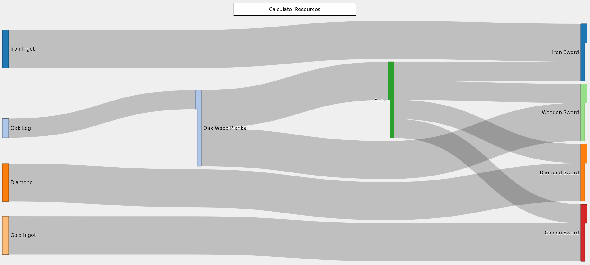

ResourceCaluclator.com is a website that can be used to calculate required resources from a list of final requirements, and tell you how to get from the raw resources to the final resources.




Creating or Updating a Calculator
=================================
If you want to add a new resource list to the calculator you will only need 4 things:  
**1)** The list of resources and what is needed to obtain them (eg: [resource_lists/minecraft/resources.yaml](resource_lists/minecraft/resources.yaml))  
**2)** A set of rectangular images of uniform size for each of the resources (eg: [resource_lists/minecraft/items/](resource_lists/minecraft/items/))  
**3)** A 300px by 150px thumbnail of the game you are making a calculator for (eg: [resource_lists/minecraft/icon.png](resource_lists/minecraft/icon.png))  
**4)** A folder in `resource_lists/` for all of the files to live in (eg: [resource_lists/minecraft](resource_lists/minecraft))  

resources.yaml
--------------
The resource list is a yaml file that contains all the recipes for each possible item in the game. All items will have a "Raw Resource" type to allow users to ignore any materials needed for crafting that resource, and because some resouces are base resources that you cannot crraft
Though key/value mappings are not inherently ordered, when we build the calculator page the order is preserved from the yaml file
allowing one to order the items in a coherient manner.
```
resources:
  Lithium:
  - output: 1
    recipe_type: Raw Resource
    requirements:
      Lithium: 0

  Small Battery:
  - output: 1
    recipe_type: Backpack Printer
    requirements:
      Lithium: -1
  - output: 1
    recipe_type: Raw Resource
    requirements:
      Small Battery: 0

  Medium Battery:
  - output: 1
    recipe_type: Printer
    requirements:
      Lithium: -2
  - output: 1
    recipe_type: Raw Resource
    requirements:
      Medium Battery: 0
```
For ease of reading we will allways have the key order be `output`, `recipe_type`, `requirements`, and then optionally `extra_data` where you can store extra information about the item in an unstructured map

items/[itemname].png
-----------
For each itme in your resources.yaml file you will need to have an image for that resource. If an image is missing then the build process will submit a warning and fill that space with a purple color indicating it does not have an icon.
The icons can be any size, even rectangular, but they all must be the same size as each other for a given calculator.
The file names of each file should be the resource name in all lower case with no spaces or punctuation. For Example:  
*"Pink Stained Glass Pane"* becomes *[pinkstainedglasspane.png](resource_lists/minecraft/items/pinkstainedglass.png)*  
*"Jack 'o Lantern"* becomes *[jackolantern.png](resource_lists/minecraft/items/jackolantern.png)*  

icon.png
--------
The icon needs to be 300px by 150px to fit in with the other calculator links. It also needs to be in the `png` format, not `jpeg`.

Compiling The Calculator
========================

On linux you will need to have python3 installed as well as several python depenencies found in requirements.txt
```
sudo apt install python3 python3-pip pngquant
sudo pip install -r requirements.txt
python3 build.py
```
On windows you should be able install the same dependencies via pip though I am unsure how to use pngquant on windows, maybe the code will produce a warning if it cant find the binary and then continue on becuase compressing the images sheets while developing is not as nessasary.
